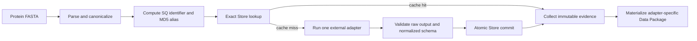
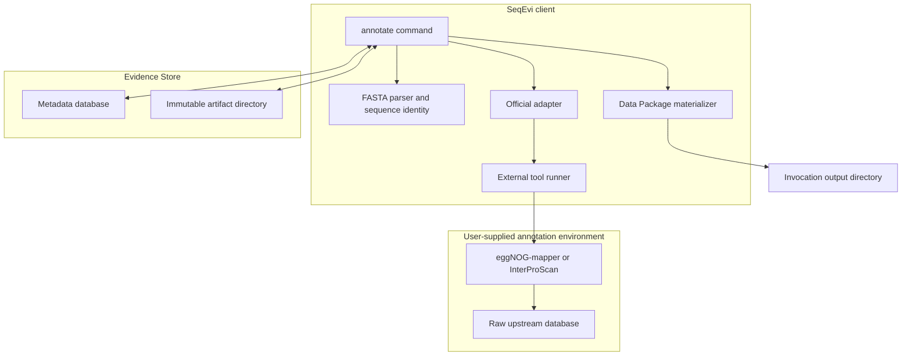
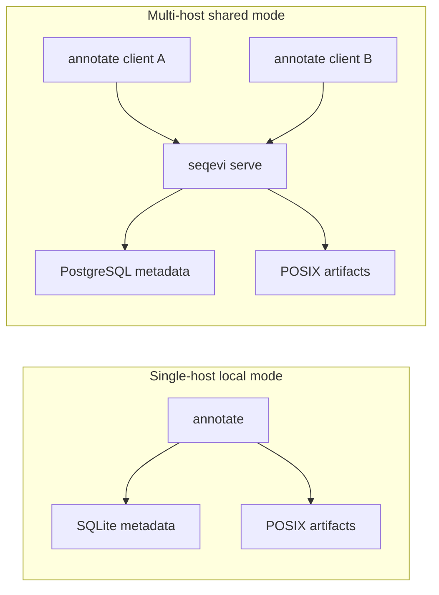

# SeqEvi v1 Architecture

> Status: approved target architecture
> Date: 2026-07-20
> Scope: standalone SeqEvi project

## Decision Summary

SeqEvi is a content-addressed evidence cache for protein sequence annotation.
It accepts a protein FASTA, identifies sequences by canonical content, reuses
evidence produced under an exact annotation contract, runs one external adapter
only for missing sequences, and materializes an adapter-specific result package.

The project is intentionally independent of any proteomics workflow. It has no
project entity, no WDL integration, no workflow scheduler, and no knowledge of
CephFS, Kubernetes, or a specific laboratory product.

The public name is **SeqEvi: Sequence Evidence**. The repository, Python package,
PyPI distribution, and command are all named `seqevi`.

## Problem

Annotation is commonly repeated because FASTA files are compared by filename or
project instead of by sequence content. A reference FASTA may contain 2,000
proteins, a later customer FASTA may reuse 1,000 of them, and another FASTA may
reuse those 1,000 while adding 500 novel proteins. The reusable unit is the
canonical protein sequence, not the FASTA or project.

SeqEvi makes that reuse automatic while preventing accidental reuse across
different tool versions, database versions, adapter contracts, or semantic
parameters.

## Core Invariants

1. Sequence identity is derived from canonical sequence content.
2. Evidence reuse requires an exact evidence key; there is no `latest` fallback.
3. Evidence is immutable. A changed contract creates a new evidence version.
4. Each annotation invocation uses exactly one adapter.
5. Third-party tools and databases remain external to SeqEvi.
6. Adapter schemas remain separate and retain third-party semantics.
7. A failed input or tool run cannot partially commit evidence.
8. The output directory is an invocation result, not a persisted project model.

## Annotation Flow



`annotate` owns this orchestration. A shared Store service remains passive: it
answers lookups, validates commits, stores artifacts, and returns evidence. It
does not schedule tools or inspect compute infrastructure.

## Component Boundaries



## Public Commands

V1 exposes only two commands:

```text
seqevi annotate
seqevi serve
```

- `annotate` parses input, resolves cache hits, runs one adapter for misses,
  commits valid evidence, and writes the output package.
- `serve` exposes a PostgreSQL/POSIX Store over HTTP for multi-host use.

There is no `register`, `export`, `project`, `worker`, `scheduler`, `pack`, `gc`,
or arbitrary plugin command in v1. Registration is an internal consequence of a
successful `annotate` commit.

## Official V1 Adapters

| Adapter | Purpose | Authority |
| --- | --- | --- |
| `eggnog` | eggNOG-mapper protein annotation | eggNOG-mapper primary output |
| `interpro-pfam` | Direct Pfam domain scanning | InterProScan with `-appl Pfam` |

The two adapters are independent. InterProScan/Pfam is authoritative for Domain
evidence. The `PFAMs` field transferred by eggNOG-mapper remains auxiliary raw
annotation and is never silently merged with direct Pfam evidence. DIAMOND and
HMMER are implementation details of upstream tools, not standalone v1 adapters.

## Evidence Identity

The exact cache key is the tuple:

```text
SequenceID
+ AdapterContractVersion
+ ToolRuntimeDigest
+ ResourceID
+ SemanticParameters
```

All components are explicit. Tool, database, semantic parameter, or adapter
contract changes create independent evidence. Parser-only or normalized-schema
changes may reparse retained raw output only when the adapter contract explicitly
declares that raw output compatible.

See the [sequence and evidence contract](20260720-v1.0-sequence-evidence-contract.md)
and [adapter contract](20260720-v1.0-adapter-contract.md) for normative details.

## Raw and Normalized Evidence

Each successful tool batch retains one compressed, machine-readable primary
third-party output in the artifact store. Temporary directories, search indexes,
and ordinary logs are not retained as evidence.

Normalization is deliberately thin:

- add canonical `SequenceID` linkage;
- preserve third-party row grain, column names, and semantics where practical;
- normalize only required types and null representations;
- keep every adapter in its own schema and output package.

SeqEvi does not create one universal annotation table.

## Deployment Modes



Local mode requires an explicit `--store` path or `SEQEVI_STORE`; it does not
create a hidden store under the user's home directory. Shared clients use the
service URL and do not receive database credentials. SQLite must not be used as
a multi-host WAL database on NFS or CephFS. The artifact directory may be a
mounted POSIX filesystem; SeqEvi treats it as a normal path.

## Technology Choices

| Concern | V1 choice | Reused capability |
| --- | --- | --- |
| Runtime | Python 3.12+ | Standard Python packaging |
| Packaging | PDM and `pdm-backend` | Wheel and sdist publication |
| CLI | Typer | Typed command surface |
| FASTA parsing | Biopython `SimpleFastaParser` | Mature streaming parser |
| Sequence identity | GA4GH refget algorithm | Standard `SQ.` identifiers |
| Tabular processing | Polars and Parquet | Columnar adapter outputs |
| Package metadata | Data Package v2 and `dplib-py` | Standard resource descriptor |
| Persistence | SQLAlchemy Core and Alembic | SQLite/PostgreSQL schema parity |
| Shared API | FastAPI, Uvicorn, HTTPX | HTTP service and client |
| Validation | Pydantic at boundaries | Explicit public/config schemas |
| Testing | pytest, Hypothesis, Ruff, Pyright | Contract and quality checks |

Internal immutable values use frozen, slotted dataclasses. Pydantic is reserved
for configuration, API, and manifest boundaries. Rust/PyO3 is not justified for
v1; profiling evidence is required before adding a native extension.

SeqRepo is prior art, not a runtime dependency. It provides versioned sequence
snapshots, aliases, and random sequence access. SeqEvi needs a smaller sequence
identity table and an annotation-evidence cache. A future `SequenceProvider`
boundary may use refget or SeqRepo when accession-only input is introduced.

## Deliberate Non-Goals

- Species inference or taxonomy classification.
- Project/customer metadata in the shared Store.
- Installation or orchestration of third-party tools.
- Distribution of eggNOG, InterPro, Pfam, or other annotation databases.
- Docker, Kubernetes, Slurm, WDL, Nextflow, or Cromwell management.
- Cross-adapter schema merging.
- Automatic history deletion or garbage collection.
- Authentication and authorization inside the v1 service.
- S3/object-store support or a generic plugin framework.

Container images for supported third-party runtimes may be documented or
published separately where licenses permit. Users may instead point adapters at
their own local installations. In both cases, the runtime digest and resource ID
remain part of the evidence key.

## Evolution Boundaries

The architecture intentionally leaves narrow extension points:

- a new official adapter can implement the same explicit adapter contract;
- a future `SequenceProvider` can resolve accession-only input;
- a future artifact backend can implement immutable put/fetch semantics;
- authentication can be added at the deployment boundary;
- history retention and garbage collection can be introduced with an explicit
  reachability contract.

These are not v1 features and must not expand the initial implementation before
the validation contract is met.
