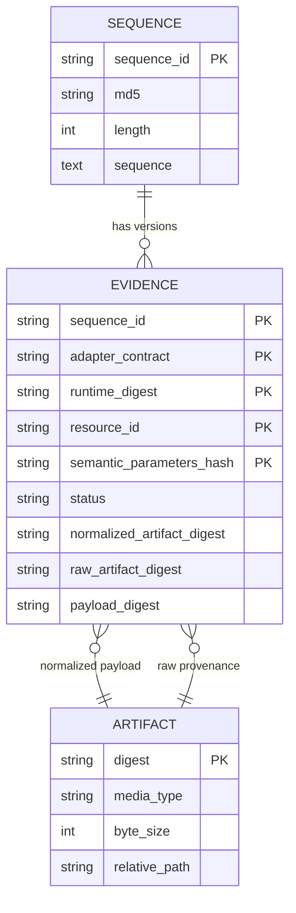
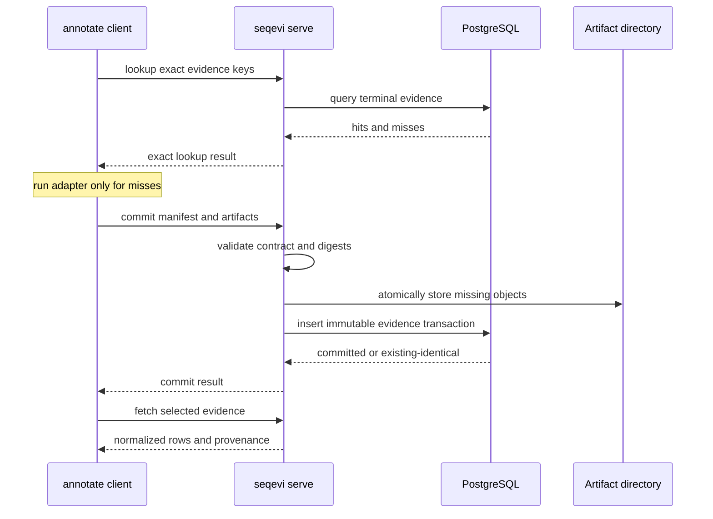

# Storage and Deployment Architecture

> Status: approved target architecture
> Contract version: 1.0
> Date: 2026-07-20

## Purpose

SeqEvi provides one logical Store contract in two deployments:

- local mode for one host, using SQLite and a POSIX artifact directory;
- shared mode for many compute hosts, using an HTTP service, PostgreSQL, and a
  POSIX artifact directory owned by the service.

The Store is an evidence cache and provenance index. It is not a project
database, workflow scheduler, or FASTA archive.

## Logical Store

The logical Store contains three kinds of information:

1. canonical protein sequences;
2. immutable evidence records keyed by the exact annotation contract;
3. content-addressed raw and normalized artifacts.

A minimal conceptual model is:



The physical schema may normalize repeated contract fields, but it must preserve
the exact uniqueness and immutability represented here. A normalized artifact
may contain a deterministic batch of several sequences; evidence records point
to that artifact, and materialization filters by `SequenceID`.

## Artifact Semantics

Artifacts are addressed by a cryptographic digest of their exact bytes. A
typical POSIX layout is:

```text
artifacts/
└── sha256/
    └── ab/
        └── cd/
            └── abcdef...<full digest>
```

The final path is an implementation detail, but these properties are required:

- digest verification on write and read;
- write to a temporary file, fsync as appropriate, then atomic rename;
- immutable final objects;
- idempotent insertion of identical bytes;
- an integrity error if metadata and bytes disagree;
- database references become visible only after artifacts are durable.

Artifacts do not contain project or customer directory names.

## Local Mode

The user must select a Store explicitly:

```bash
seqevi annotate \
  --store /data/seqevi-store \
  --adapter interpro-pfam \
  --fasta proteins.fasta \
  --output results/pfam \
  --executable /opt/interproscan/interproscan.sh \
  --resource /data/interproscan-5.77-108.0/data
```

`SEQEVI_STORE=/data/seqevi-store` is the environment-variable equivalent. There
is no implicit `~/.local/share/seqevi` default.

On first use, SeqEvi creates:

```text
/data/seqevi-store/
├── .migration.lock
├── store.sqlite3
└── artifacts/
```

`.migration.lock` serializes schema upgrades by local processes. It is Store
metadata, not scientific evidence.

SQLite uses transactions, foreign keys, a busy timeout, and WAL only when the
filesystem and deployment are local to one host. Multiple processes on that
same host may use the Store. Database migrations run under an exclusive startup
lock and remain backward-aware.

Revision `0002_artifact_byte_size_bigint` widens existing PostgreSQL
`artifact.byte_size` columns from 32-bit integer to 64-bit bigint. SQLite
already stores integer values in a signed 64-bit representation, so that
revision intentionally leaves existing local Store tables unchanged.

Do not place this SQLite database on NFS or CephFS for access by different
hosts. SQLite WAL requires all users to share host-local coordination semantics;
a mounted distributed filesystem does not provide the supported deployment
model.

## Shared Mode

For multi-host use, one service owns all database and artifact writes:

```bash
seqevi serve \
  --database-url postgresql+psycopg://seqevi@postgres/seqevi \
  --artifacts-dir /cephfs_data/shared/seqevi/artifacts
```

The PostgreSQL database may be empty. On first start, the service acquires a
database advisory lock and applies the supported Alembic schema. Incompatible or
newer schema versions fail startup explicitly.

The accepted node4 loopback container topology uses a user-systemd unit with the
host rootful Docker daemon at `unix:///var/run/docker.sock`. This is required
for host networking to share the physical host loopback namespace and for the
configured numeric container UID/GID to match the CephFS artifact owner
directly. A rootless Docker daemon has different network and user-namespace
semantics and is not compatible with this deployment unit.

The approved private-cluster ingress increment keeps that listener unchanged.
The existing node4 Apache service terminates TLS and Basic authentication on a
dedicated private-address listener, requires an allowed private source address,
and proxies only to `http://127.0.0.1:18081`. Certificates, CA distribution and
credentials remain deployment-owned secrets. PostgreSQL stays on loopback and
the artifact directory is never served by the proxy.

HTTP clients reject Store URLs containing userinfo. When deployment Basic
authentication is configured, the client reads exactly two non-empty UTF-8
lines (username, then password) from the regular, non-symlink, owner-only file
named by `SEQEVI_HTTP_BASIC_AUTH_FILE`. The environment value is only a path.
Credentials must not appear in URLs, execution profiles, command lines, WDL
inputs, or environment-variable values.

Clients receive only the service URL:

```bash
seqevi annotate \
  --store https://seqevi.internal.example \
  --adapter eggnog \
  --fasta proteins.fasta \
  --output results/eggnog \
  --executable /opt/eggnog-mapper/emapper.py \
  --resource /data/eggnog
```

They do not mount or open the metadata database. They also do not write directly
to the artifact directory. The service validates and atomically commits all
shared state.

The `/health` response publishes the service's maximum request batch and
artifact byte limits. Native clients discover those values when they connect,
chunk lookup and commit manifests to the advertised batch size, and enforce
the same artifact limit while downloading. Every shared evidence commit must
reference a retained raw artifact; a normalized hit artifact is additional,
not a replacement for native provenance.

Artifact byte sizes use a 64-bit database column so the configured service
limit cannot exceed the metadata representation.



The service exposes only the operations needed by `annotate`, conceptually:

- `lookup`: return exact terminal evidence states for a set of keys;
- `commit`: validate artifacts and atomically insert immutable records;
- `fetch`: retrieve selected normalized evidence and provenance.

The Phase 5 OpenAPI contract freezes these v1 paths:

```text
GET  /health
POST /v1/evidence/lookup
POST /v1/evidence/fetch
POST /v1/evidence/fetch-many
PUT  /v1/artifacts/{sha256}
GET  /v1/artifacts/{sha256}
POST /v1/evidence/commit
```

Artifacts are uploaded and downloaded independently of metadata requests so the
service can stream bytes and verify digest and size without buffering a complete
artifact in memory. Evidence becomes visible only after the final metadata
commit. Batch and artifact limits are explicit service settings.

`fetch-many` is additive to the original single-record endpoint. It returns
metadata only; clients deduplicate referenced digests and stream each artifact
at most once. Large outputs never cross the Python API as one `bytes` value.

## CephFS and Other Shared Filesystems

SeqEvi has no CephFS-specific code. To SeqEvi, the shared artifact root is a
POSIX directory. CephFS may supply that directory to the single service
deployment, while PostgreSQL supplies metadata concurrency.

This means:

- Kubernetes jobs may run `annotate` on different hosts;
- every job talks to `seqevi serve` over HTTP;
- only the service writes Store artifacts and PostgreSQL metadata;
- invocation output directories may independently reside on CephFS;
- no job opens `store.sqlite3` on CephFS.

## Concurrency Model

V1 intentionally has no distributed claim or lease protocol. A lookup is a
snapshot, not a lock. Concurrent clients may both compute the same miss.

Correctness comes from:

- deterministic evidence identity;
- content-addressed artifacts;
- a unique database constraint on the complete evidence key;
- atomic transactions;
- payload digest comparison for duplicate commits.

This favors a small, reliable implementation. A future claim protocol is
justified only if measured duplicate compute is operationally significant.

## Output Directories Are Not the Store

`--output` materializes the current FASTA's adapter package for a person or
downstream program. It may be deleted and recreated from the Store. The output
does not define a project and is never searched as a cache.

`--store` points to durable reusable evidence. It contains no copied project
layout and is not designed for direct browsing by end users.

## Security Boundary

V1 does not implement users, organizations, RBAC, or API keys. A shared service
must be protected by deployment controls such as a private network, ingress
authentication, TLS termination, and PostgreSQL credentials available only to
the service.

The API still validates paths, sizes, media types, digests, and schema. Deployment
authentication does not replace data-integrity checks.

## Backup and Portability

A valid backup consists of a transactionally consistent PostgreSQL/SQLite
snapshot plus every referenced artifact. Artifact files alone are insufficient;
metadata alone is also insufficient.

V1 provides no Store export or replication command. Standard database and POSIX
backup tools are used. A future portability feature must preserve sequence IDs,
complete evidence keys, artifact digests, and immutable provenance without
re-keying.

## Failure Recovery

- A failed tool run commits nothing.
- A failed artifact upload leaves only unreferenced temporary data.
- A process crash before the metadata transaction commits exposes no evidence.
- An existing identical artifact or evidence record makes retry idempotent.
- Missing or corrupt referenced artifacts make the Store unhealthy and fail
  reads loudly; SeqEvi never treats corruption as a cache miss.

Automatic garbage collection is out of scope. V1 retains historical evidence
and may provide an audit report for unreferenced temporary objects without
deleting them.
